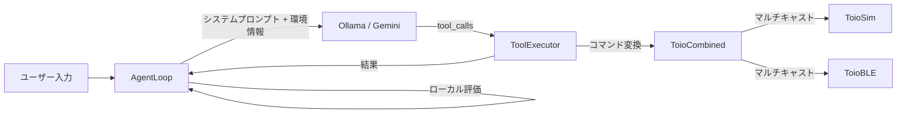

# LLM → toio 制御パイプライン 調査レポート (2026-04-18)

> **対象ファイル**: `tools-schema.js`, `tool-executor.js`, `agent-loop.js`, `toio-combined.js`, `toio-ble.js`, `toio-sim.js`, `spatial-awareness.js`, `environment.js`, `ollama-client.js`, `gemini-client.js`, `session-memory.js`

---

## アーキテクチャ概要

---

## 🔴 バグ・重大な問題

### B-1: `move_to` のシミュレータ返り値の型不一致

| 項目 | 詳細 |
|:--|:--|
| **ファイル** | [toio-sim.js:75](file:///c:/Users/kouga/Projects/Web/toio-lab-web/js/toio-sim.js#L75) |
| **問題** | `moveTo()` が `resolve(0x00)` と **数値**を返すが、`ToioBLE.moveTo()` は `{result, resultStr}` **オブジェクト**を返す |
| **影響** | BLE未接続時に `ToioCombined.moveTo()` が合成結果 `{result: 0x00, resultStr: "Success"}` を返すが、シミュレータ自体の返り値は不整合。将来シミュレータ結果を直接参照するとバグになる |
| **修正案** | `resolve({result: 0x00, resultStr: "Success"})` に統一する |

### B-2: `toio-context-spec.md` とコードの乖離

| 項目 | 詳細 |
|:--|:--|
| **ファイル** | [toio-context-spec.md:75-88](file:///c:/Users/kouga/Projects/Web/toio-lab-web/.agent/memory/toio-context-spec.md#L75-L88) |
| **問題** | ドキュメントのツール表に `move_to` と `get_battery` が記載されていない。また `think` ツールが記載されているが `agentTools` フィルタからは除外されている |
| **影響** | エージェント仕様ドキュメントが実コードと一致しておらず、将来のメンテナンスで混乱を招く |

### B-3: `architecture.md` のモデル名が古い

| 項目 | 詳細 |
|:--|:--|
| **ファイル** | [architecture.md:10](file:///c:/Users/kouga/Projects/Web/toio-lab-web/.agent/memory/architecture.md#L10) |
| **問題** | `gemma4:4b-it` と記載されているが、実際のコードは `gemma4:e4b` を使用 |

---

## 🟡 設計上の課題

### D-1: `move_forward` / `move_backward` / `turn` が `agentTools` から除外されているが定義は残存

| 項目 | 詳細 |
|:--|:--|
| **ファイル** | [tools-schema.js:246-248](file:///c:/Users/kouga/Projects/Web/toio-lab-web/js/tools-schema.js#L246-L248) |
| **問題** | `agentTools` フィルタで `move_forward`, `move_backward`, `turn` を除外しているが、`tool-executor.js` にはこれらの実行コードが残っている。さらに `tools-schema.js` でも定義が残っている |
| **影響** | デッドコードが蓄積。LLMが直接 `toioTools` を受け取る経路があれば意図せず使われる可能性がある |
| **修正案** | (A) 完全に削除する、(B) フラグで切替可能にする。現状 `move_to` で十分カバーできるなら (A) を推奨 |

### D-2: `think` ツールが `agentTools` から除外

| 項目 | 詳細 |
|:--|:--|
| **ファイル** | [tools-schema.js:246-248](file:///c:/Users/kouga/Projects/Web/toio-lab-web/js/tools-schema.js#L246-L248) |
| **問題** | `think` はシステムプロンプトで「頭の中で手順を考え」と指示しているが、明示的な `think` ツールは Agent には渡されていない |
| **影響** | LLMがテキスト内で暗黙的に思考するか、無視するかはモデル依存。特に小型モデル（4B）では明示的な思考ツールがある方が精度が上がる可能性がある |
| **修正案** | `agentTools` に `think` を復活させることを検討 |

### D-3: `_localEvaluate` が `move_to` のクランプ座標を考慮していない

| 項目 | 詳細 |
|:--|:--|
| **ファイル** | [agent-loop.js:20-48](file:///c:/Users/kouga/Projects/Web/toio-lab-web/js/agent-loop.js#L20-L48) |
| **問題** | `_localEvaluate` は `toolCall.function.arguments` の元の座標（クランプ前）と実際の到着位置を比較している。座標がクランプされた場合、永遠に「未達成」と判定される可能性がある |
| **修正案** | `tool-executor.js` の `move_to` 結果に `clamped_target: {x, y}` を含め、`_localEvaluate` ではクランプ後の座標と比較する |

### D-4: セッションメモリが活用されていない

| 項目 | 詳細 |
|:--|:--|
| **ファイル** | [agent-loop.js:57-70](file:///c:/Users/kouga/Projects/Web/toio-lab-web/js/agent-loop.js#L57-L70), [session-memory.js](file:///c:/Users/kouga/Projects/Web/toio-lab-web/js/session-memory.js) |
| **問題** | `SessionMemory.buildContextString()` がシステムプロンプトに注入されていない。`addSummary` でセッション結果は保存されているが、次回のプロンプト構築時に読み込まれない |
| **影響** | セッション間の文脈継続（「さっきやったやつ」等の参照）が機能しない |
| **修正案** | `executorSystemPrompt` 構築時に `this.memory.buildContextString()` を追加する |

### D-5: 環境情報の二重定義

| 項目 | 詳細 |
|:--|:--|
| **ファイル** | `agent-loop.js:75-77` と `tools-schema.js:246-248` |
| **問題** | `agentTools` のフィルタリングが `agent-loop.js` と `tools-schema.js` の両方で同じリストを使って行われている |
| **影響** | 片方だけ変更した場合に不整合になる |
| **修正案** | `tools-schema.js` で `agentTools` を唯一のソースとし、`agent-loop.js` ではそのまま使用する |

### D-6: OllamaClient にリトライ機構がない

| 項目 | 詳細 |
|:--|:--|
| **ファイル** | [ollama-client.js:63-89](file:///c:/Users/kouga/Projects/Web/toio-lab-web/js/ollama-client.js#L63-L89) |
| **問題** | `GeminiClient` にはリトライ(3回) + タイムアウト(30s) があるが、`OllamaClient` にはどちらもない |
| **影響** | ローカルOllamaがビジー時やモデルロード中にリクエストが即座に失敗する |
| **修正案** | `GeminiClient` と同等のリトライ + タイムアウト機構を追加 |

---

## 🟢 追加提案

### A-1: `play_melody` — 複数音符のシーケンス再生

| 項目 | 詳細 |
|:--|:--|
| **現状** | `play_sound` は1音しか再生できない。メロディを演奏するにはLLMが複数回呼び出す必要がある |
| **提案** | toio仕様の「MIDI再生」コマンド（0x03のマルチノート版）を使い、配列で複数音を指定できるツールを追加 |
| **例** | `play_melody({notes: [{note: 60, duration_ms: 200}, {note: 64, duration_ms: 200}]})` |

### A-2: `move_path` — 複数座標の連続移動

| 項目 | 詳細 |
|:--|:--|
| **現状** | `move_to` は1座標のみ。パスを描くには複数回の呼び出しが必要で、LLMのツールコール上限(5回)に達しやすい |
| **提案** | 座標配列を受け取り、順番に `moveTo` を実行するツールを追加 |
| **例** | `move_path({waypoints: [{x:200, y:200}, {x:300, y:200}, {x:300, y:300}]})` |
| **注意** | ツールコール数の削減に寄与するが、LLMが複雑なJSON配列を正しく生成できるか要検証 |

### A-3: `set_light_pattern` — LEDアニメーション

| 項目 | 詳細 |
|:--|:--|
| **現状** | `set_light` は固定色のみ |
| **提案** | toio仕様の「連続点灯」コマンドを使い、色の配列による点滅パターンを追加 |

### A-4: ツールの成功/失敗をより詳細にフィードバック

| 項目 | 詳細 |
|:--|:--|
| **現状** | 多くのツール結果が `{status: "success", desc: "..."}` のみ |
| **提案** | 全ツール結果に `after_state: {x, y, angle}` を統一的に含め、LLMが次の判断に使えるフィードバック品質を向上させる |

### A-5: `get_position` 返り値に「ランドマーク」情報を追加

| 項目 | 詳細 |
|:--|:--|
| **現状** | `get_position` は座標と端までの余裕のみ返す |
| **提案** | マット上の領域名（「左上エリア」「中央」等）や相対位置（「マットの右端に近い」）を自然言語で追加し、LLMの空間理解を支援 |

### A-6: エラーリカバリ・自動再実行

| 項目 | 詳細 |
|:--|:--|
| **現状** | ツール実行エラー時は `{status: "error"}` を返してLLMに次の判断を委ねる |
| **提案** | BLE書き込みエラー等の一時的な障害に対し、`ToolExecutor` レベルで1回リトライしてからエラーを返す |

---

## ⚙️ コード品質・保守性

### Q-1: `tool-executor.js` の `case` 内で `const` / `let` が曖昧

| 項目 | 詳細 |
|:--|:--|
| **ファイル** | [tool-executor.js:120](file:///c:/Users/kouga/Projects/Web/toio-lab-web/js/tool-executor.js#L120), [tool-executor.js:146](file:///c:/Users/kouga/Projects/Web/toio-lab-web/js/tool-executor.js#L146) |
| **問題** | `turn` と `get_battery` の `case` でブロックスコープ `{}` なしに `const` を使用している。Strict mode ではエラーにならないが、fall-through の可能性がある場合は安全ではない |
| **修正案** | `move_forward` / `move_backward` と同様に `case "turn": { ... break; }` のようにブロックスコープを追加 |

### Q-2: `toio-sim.js` の `_update` で毎フレーム `bind` を呼んでいる

| 項目 | 詳細 |
|:--|:--|
| **ファイル** | [toio-sim.js:165](file:///c:/Users/kouga/Projects/Web/toio-lab-web/js/toio-sim.js#L165) |
| **問題** | `requestAnimationFrame(this._update.bind(this))` が毎フレームで新しい関数オブジェクトを生成 |
| **修正案** | コンストラクタで `this._boundUpdate = this._update.bind(this)` を保持し、それを渡す |

### Q-3: マット座標のハードコード重複

| 項目 | 詳細 |
|:--|:--|
| **ファイル** | `toio-sim.js:82-83,93-94`, `spatial-awareness.js:6` |
| **問題** | マット座標範囲 (`98, 402, 142, 358`) が `toio-sim.js` と `spatial-awareness.js` で別々にハードコードされている |
| **修正案** | `SpatialAwareness` インスタンスから取得するか、共通の定数ファイルに統一 |
